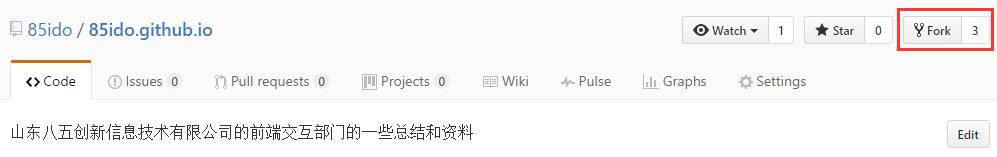
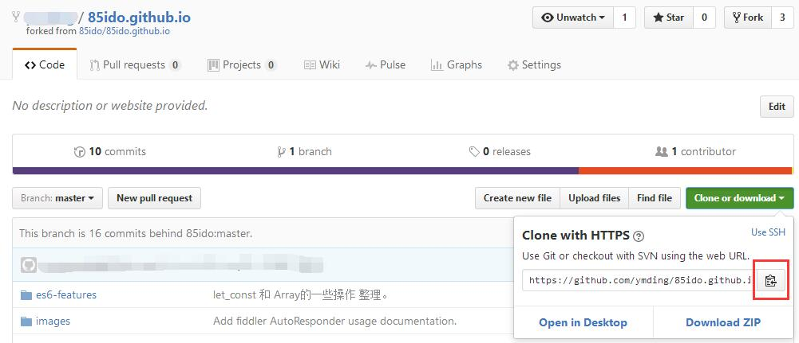
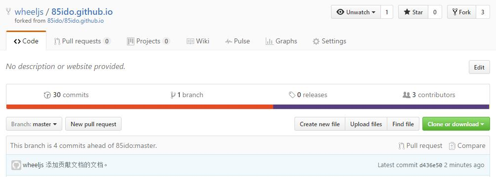
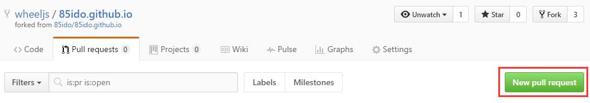
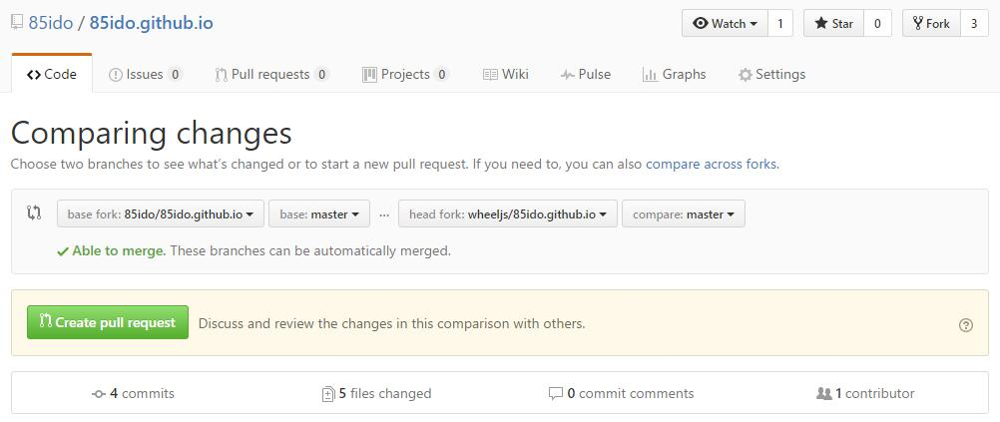
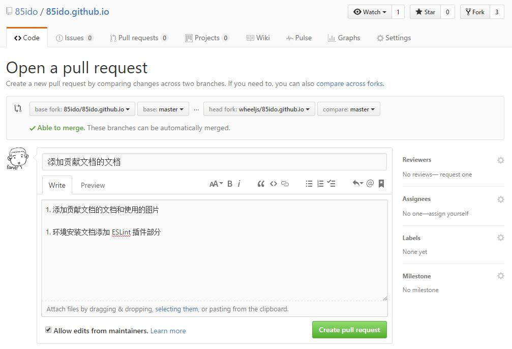
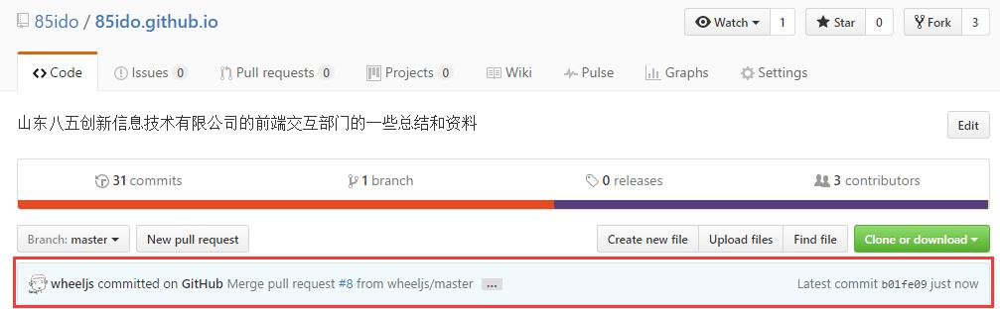

# 85ido.github.io

山东八五创新信息技术有限公司的前端交互部门的一些总结和资料。

## 贡献文档

在开始贡献文档之前：

1. Fork 这个库

    

1. Fork 之后，会在自己的仓库列表中出现一个新仓库，clone 这个新仓库到本地。

    

贡献文档：

1. 将文档提交到新仓库

    

1. 确认文档完成并检查后，在 **Fork 仓库**中点击 Pull requests > New pull request

    

1. 会跳转到原本的库并比较改动，并给出是否可以自动合并

    

1. 确认无误后点击 **Create pull request**，输入 Pull request 的标题和描述。

    *建议：*Pull request 的描述与提交日志类似。

    

1. 点击 **Create pull request**，等待通过，就可以在主仓库中看到你的提交了。

    

### 常见问题：我如何将主库上其他的提交合并到我的 Fork 库？

参考：

- [Configuring a remote for a fork](https://help.github.com/articles/configuring-a-remote-for-a-fork/)

- [Syncing a fork](https://help.github.com/articles/syncing-a-fork/)

1. 在本地的 Fork 库添加一个远端

```bash
$ git remote add upstream https://github.com/85ido/85ido.github.io.git
```

1. 以后每次与主库同步时，只需要执行

```bash
$ git pull 85ido master
```
