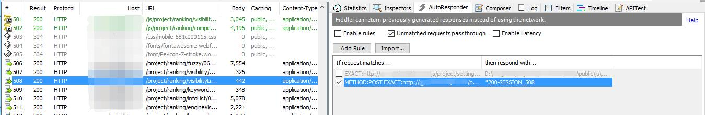
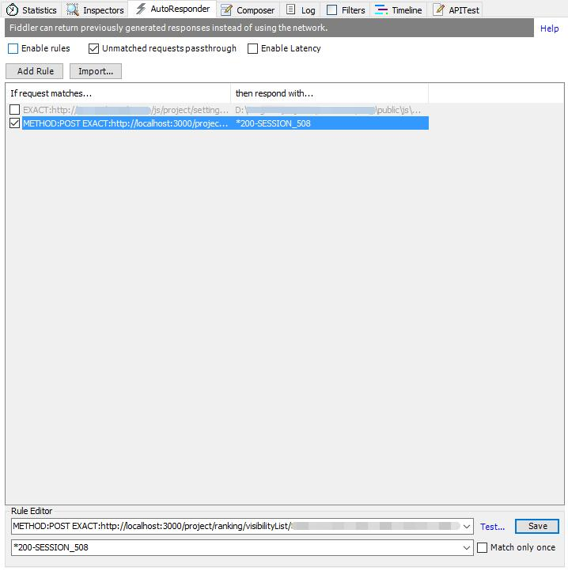

# Fiddler 使用

Fiddler 被称为 Web 开发、调试利器，最常用的是查看每一个请求的 request 和 response 信息。

本文将会借助 Fiddler 的 AutoResponder 功能介绍实现在线上预览前端更改和在本地使用线上数据两部分。

## 在线上预览前端更改

有时候，某些数据情况只有在线上才会出现，所以某些修改可以先在线上预览一下，确认没有问题再发布到线上，节省时间，降低风险。

步骤示例：
1. 准备好本地修改完成，需要替换的 js
    

1. 打开 Fiddler，请求目标页面，找到原始 js 的请求，将请求拖拽到 AutoResponder 中
  
    *注：*
    - 左下角选择 Web Browsers 可以只显示浏览器发起的请求
    - 点击左下角的 Capturing 可以开启或关闭 Fiddler 的请求捕获

    此时，从浏览器的 DevTools 中可以看到，这个 js 是线上的版本
    

    

1. 在 AutoResponder 中修改响应，使其指向第一步中准备好的文件
    
    

1. 点击 Save，选定的请求的 the respond with 列应该显示刚才选好的文件路径，如果只需要匹配1次，可以勾选 `Match only once` 选项

    

1. 确保 AutoResponder 的 Enable rules 打开，刷新页面
    
    *确保 Unmatched request passthrough 选项打开，该选项开启时会放过不匹配的请求*

    

    此时再从 DevTools 中查看 js，发现 js 已经变成了本地未被 minify 的版本
    

1. 待测试完成，关闭 AutoResponder 或去掉列表中的对勾，表示不开启这条规则
    

## 在本地使用线上接口的数据

原理与“在线上使用本地js”类似：通过 AutoResponder 将线上的响应保存起来，修改匹配的Url给其他请求使用。

1. 请求线上数据接口，获取数据
    

1. 将请求拖拽到 AutoResponder 中
    

1. 修改匹配的Url，修改成要替换的本地数据接口，点击保存

    

    *如果需要在浏览器中直接查看数据，可以去掉匹配Url最前面的 `METHOD:POST`*
    
    
1. 刷新本地页面，查看数据，这里直接在浏览器中查看

    
