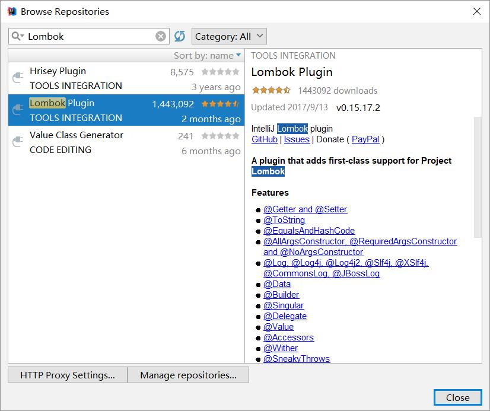
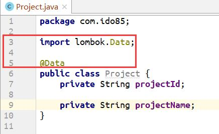
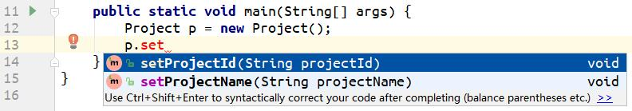
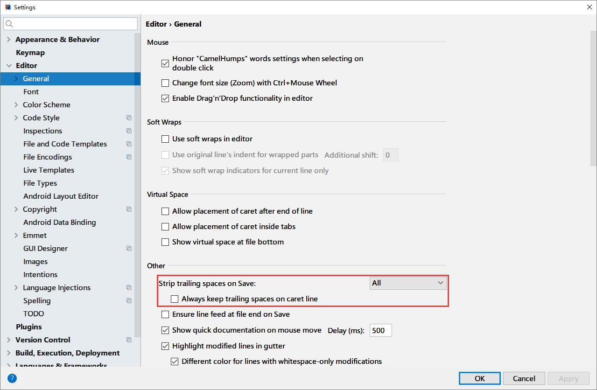
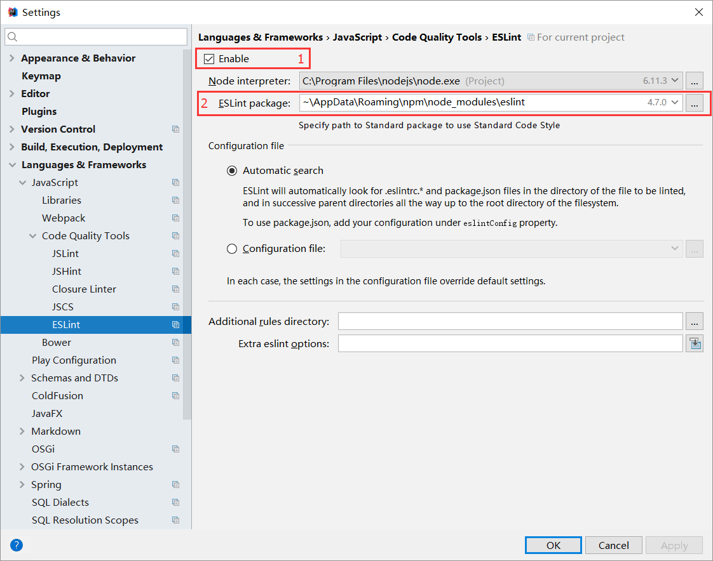

# IDEA 的使用和插件

IDEA 是最好用的 Java IDE，没有之一。通过配置和插件，IDEA 也可以和部分前端 workflow 很好的结合。

## 插件

### Lombok

写 Java 代码时，占比最多的就是 Java POJO(Plain Old Java Object) 中的 getter 和 setter 方法，因为 Java 没有语法糖，所以在想获取或设置对象的属性时必须用过 getter 和 setter，这就造成了我们要重复去写这部分代码，虽然大多数 IDE 提供了快捷生成的功能，但是还是需要花时间去点击和调整。

Lombok 就是用来解决这种问题的，通过安装插件 + 在项目中依赖的方式，通过在 POJO 类上添加 `@Data` 注解，可以在编译时直接生成 getter 和 setter，节省代码量。Lombok 还提供了一些注解对 getter, setter, constructor 进行定制。

[继续阅读](https://projectlombok.org/features/all)

#### 使用 Lombok

1. 在 pom.xml 中添加 lombok 依赖

    ```xml
    <dependency>
        <groupId>org.projectlombok</groupId>
        <artifactId>lombok</artifactId>
        <version>1.16.8</version>
    </dependency>
    ```

1. IDEA 中安装 Lombok 插件

    **File > Settings > Plugins**，选择 **Browse repositories**，输入 **Lombok**

    

1. 点击右侧名称下方的 **Install**，安装 Lombok，安装后会要求重启 IDEA

1. 在 POJO 类上添加 `@Data` 注解，注意 import 的包名

    

1. 编写代码，调用 setter

    

## EditorConfig

EditorConfig 是一部分常用的格式描述定义文件，目前大部分编辑器都已经原生或通过插件的方式支持读取 EditorConfig 规则。通过在项目中添加 `.editorconfig` 文件，将规则写在该文件中即可在其他代码文件中应用这些格式。

[继续阅读](http://editorconfig.org/)

[在 VSCode 中安装 EditorConfig 插件](https://85ido.github.io/setup.html#%E9%85%8D%E7%BD%AE)

IDEA 中已经默认对 EditorConfig 进行支持，只是有一个小地方会影响使用体验：

当 `trim_trailing_whitespace` 配置为 `true` 时，IDEA 默认的处理方式会导致部分行不会被修正，会保留空格，这样会触发 ESLint 的 `no-trailing-spaces` 规则。通过修改 IDEA 的配置，可以使 IDEA 默认 trim 所有的行尾的空格（以及只有空格，但保持缩进的行）。

配置方式：

**File > Settings > Editor > General > Other**

将 *Strip trailing spaces on Save* 修改为 *All*，去掉 *Always keep trailing spaces on caret line* 的勾。

最终配置：



这样就可以实现与 VSCode 安装插件后一样的行为，即在保存时，无论是否为当前行，都会去掉行尾的空格（及保持缩进的空行的空格）。

## ESLint

ESLint 是一个开源的 js 代码检查工具，通过架构和插件机制实现比 JsHint 更加灵活的配置和校验。ESLint 的配置文件 (.eslintrc.js) 已经成为项目的标配，这部分内容主要讲解如何在 IDEA 的编辑代码视图中直接查看 ESLint 结果，类似于查看 Java 代码中的 Warning 和 Error。

### 使用 ESLint 

1. 在默认配置中开启 ESLint 配置

    **File > Other Settings > Default Settings > Language & Frameworks > JavaScript > Code Quality Tools > ESLint**

    *跳到步骤3，该步骤配置完成后，新导入的项目会自动继承该默认配置，无需重复步骤2。*

1. 在项目配置中开启 ESLint 配置

    **File > Settings > Language & Frameworks > JavaScript > Code Quality Tools > ESLint**

    *该步骤只对当前项目有效，更换项目时需要重新配置。*

1. 配置

    

    保持 *1* 的位置勾选

    如果 *2* 的文本框中为空，需要先安装 ESLint

    ```shell
    $ cnpm install -g eslint
    ```

## Gulp

*To Be Done*
