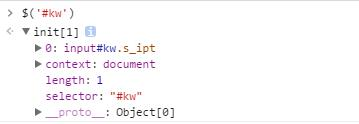

# jQuery

## 背景

jQuery最大的**feature**，就是通过封装解决了各个平台操作DOM、事件监听和Ajax请求的差异。

文中代码是基于[jQuery 1.12.4](//cdn.bootcss.com/jquery/1.12.4/jquery.js)书写的。

## 选择器和常用操作

### 选择器

jQuery的选择器强大而丰富，不仅支持全部CSS选择器，还支持部分扩展选择器。

```javascript
// jQuery 默认向 window 对象公开 $ 属性，所以在无冲突时 jQuery 和 $ 是等价的
$('div') // 选择所有 div 标签
$('#container') // 选择 Id 是 container 的元素
$('.btn') // 选择所有有 btn 类的元素
$('[data-todo]') // 选择所有包含 data-todo 属性的元素
$('all css selector') // 所有 css 选择器

// jquery 拓展的选择器
$(':buttons') // 选出所有 button 标签和 input[type='button']
$(':input') // 选择所有 input, textarea, select, button 元素
```

```javascript
// 选出百度首页的输入框
$('#kw')
```


注意：jQuery选择器返回的是Array Like（伪数组），如果要逐个操作元素，可以使用 `$.each(array, callback)`。

*Array Like（伪数组）：就是有 length 属性的对象*

**$.each的回调函数参数非常反人类**

**$.each的回调函数参数非常反人类**

**$.each的回调函数参数非常反人类**

#### 性能优化

jQuery选择器虽然强大，但强大带来的就是性能问题。有时候我们可能在一个函数中多次使用到某个元素，这时候如果每次用到时重新选择，并且选择器比较复杂的话，可能会造成较大的性能开销。如：

```javascript
// 获得 input 中的内容，并清空该 input，上下文略
var val = $('#todo-list .new-todo-container .new-todo').val();
// 处理 val，省略
// 清空 Todo
$('#todo-list .new-todo-container .new-todo').val('');
```

这时候应该将选择出的元素进行缓存，避免多次选择重复的元素。

```javascript
// jQuery 选择的元素，保存为变量一般是以$开头
var $newTodo = $('#todo-list .new-todo-container .new-todo');
var val = $newTodo.val();
$newTodo.val('');
```

### 常用操作

通过 jQuery 选择出的元素，就可以对元素进行操作了，下面会讲解一些常用的 jQuery 操作。

#### 添加和移除元素

#### 修改元素内部

可以在获取到元素后修改元素内容，修改元素内容至少有三个方法。

`.html(str)` 修改元素内容，str 会被当作 html 内容

`.text(str)` 修改元素内容，str 会被当作纯文本，不会解析为 html 内容 

`.val(str)` 修改元素内容，一般用来向 input, textarea 元素赋值

#### 获取元素属性

获取元素后可以对元素的属性进行操作

`.attr(name[, value])` 获取元素的 attribute，如果带有第二个参数，设置元素的 attribute 的值为 value

`.prop(name[, value])` 获取元素的 property，如果带有第二个参数，设置元素的 property 的值为 value

`.prop` 获取的是运行时的值，对于 `checked`, `selected` 属性，获取的是即时的值，使用 `.attr` 只会获取到定义在元素上的值

#### 类和样式

## 事件绑定和处理

## 发送和处理请求

## Question
