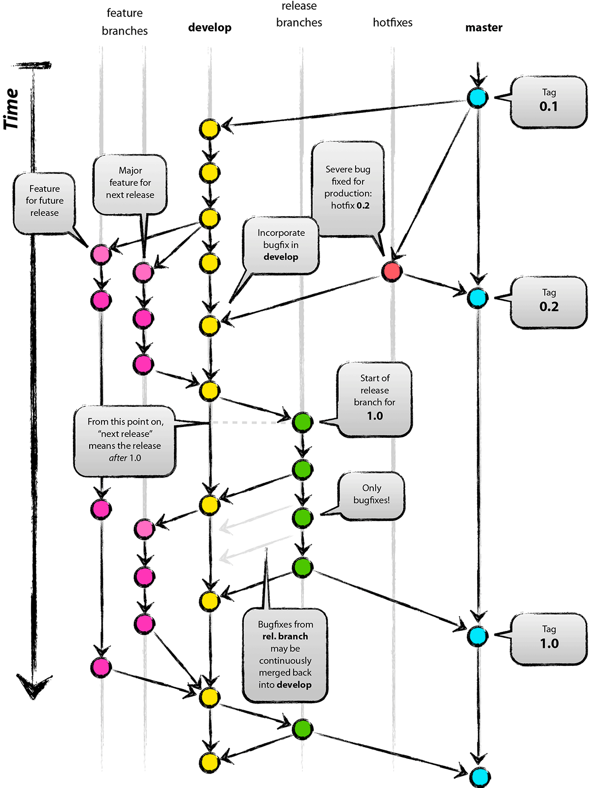

# 党建项目版本管理方法，研发中心侧说明

这篇文章主要介绍了研发中心内部将要实施的版本管理办法中与日常开发相关的流程和概念。阅读本文需要 Git 基础。

## Git 基础和应该达成的共识

将要实施的版本管理办法，在代码版本控制环节使用 Git，因此以下提到的Git 实践应为大家（开发人员）的共识。

1. 一次提交只包含一个功能。

    每次提交提交独立的功能，有利于追溯相关代码，方便回滚和cherry-pick。

1. 每个功能只在一个分支上提交。

    每个功能只在一个分支上提交，如果其他功能依赖该功能，则应该使用 merge 或 rebase 将该功能合并到依赖该功能的分支。

1. 任何时候，都有一个分支(Tag)可以直接找到与线上代码相同的代码。

## GitFlow

版本管理办法相关的流程，参考自GitFlow并有所精简，故先对GitFlow进行简单的介绍。



### 分支含义介绍

- master

    该分支与线上正在运行的代码保持一致，使用标签(Tag)标记每次发布的提交。

- develop

    开发主分支。

- feature/

    功能分支，每个功能创建一个分支进行开发。完成后将会被合并到 `develop`。

- release/

    发布分支，由 `develop` 派生。在一个或多个功能完成后创建，创建后不再向此次发布中追加新的功能，只对要发布的功能进行内部测试，修复发现的BUG。完成后将会被合并到 `master` 和 `develop`。

- hotfix/

    热修复线上的问题，由 `master` 派生。一般用来作紧急修复用，完成后讲会被合并到 `master` 和 `develop`。

### 开发流程

任务池中的任务和负责人如下：

- 1 App首页轮播图只有一张时关闭轮播效果，非常紧急(A)

- 2 某一功能展示页需要修改展示的字段和顺序(C)

- 3 后台管理系统需要允许在富文本编辑器中上传图片，优先级低，甚至可以过几个版本后发布(D)

#### 之前的开发流程举例

1. ACD 获得任务，在当前最新代码上开发，一般是 `master`

1. A 将任务1开发完成，提交到了 `master`

1. C 完成了任务2的一部分，提交到了 `master`

1. D 完成了任务3，但有明显的BUG，提交到了 `master`

1. A 更新任务进度，并通知管理人员发布

    此时未完成的任务2，3也将部分代码提交到了 `master` 上，直接发布可能会导致任务2的展示页显示与最终效果不符，任务3对应的部分直接变为不可用状态。这在项目初期，无真实用户使用的状态下可能不会造成影响，当项目进入中后期，这种问题一旦出现，会使得演示以及与客户对接的同事猝不及防。

#### 基于GitFlow的开发流程

1. A 获得任务1，基于 `develop` 创建 `feature/swipe-only-one` 分支

1. C 获得任务2，基于 `develop` 创建 `feature/detail-field` 分支

1. D 获得任务3，基于 `develop` 创建 `feature/rich-editor-image` 分支

1. A 将任务1开发完成，提交到了 `feature/swipe-only-one`

1. C 完成了任务2的一部分，提交到了 `feature/detail-field`

1. D 完成了任务3，但有明显的BUG，提交到了 `feature/rich-editor-image`

1. A 将 `feature/swipe-only-one` 合并到 `develop` 并在本地进行测试，测试无误后删除 `feature/swipe-only-one` 并将 `develop` 推送到远端仓库

1. 项目经理或负责人(P) 跟踪任务进度，基于 `develop`（此时已经合并了 `feature/swipe-only-one`）创建发布分支 `release/task1`

1. 将 `release/task1` 的代码发布到内部测试环境进行测试，通过测试后将代码合并至 `master` 和 `develop` 并删除 `release/task1`

    至此一次发布流程就结束了，后续的流程介绍其他任务完成后的处理方式

1. C 完成了任务2，将 `feature/detail-field` 合并到 `develop` 并在本地进行测试，测试无误后删除 `feature/detail-field` 并将 `develop` 推送到远端仓库

1. P 基于 `develop` （包含 `feature/swipe-only-one`, `release/task1`, `feature/detail-field`）创建 `release/task2`

1. 在本地运行 `release/task2` 的代码，发现有一处 BUG，此时 C 需要 checkout `release/task2`，修复 BUG，并提交到 `release/task2`

1. 重新测试无误后，将 `release/task2` 合并到 `master` 和 `develop` 并删除 `release/task2`

    10-13步描述了当一个功能在发布前内部测试中出现 BUG 的处理流程。

1. D 完成了任务3，代码提交到了 `feature/rich-editor-image` 并合并到了 `develop` 分支，在本地测试通过后删除 `feature/rich-editor-image` 并将 `develop` 推送到远端仓库

1. P 基于 `develop`(`feature/swipe-only-one`, `release/task1`, `feature/detail-field`, `release/task2`, `feature/rich-editor-image`) 创建 `release/finish-task-pool`

1. 内部测试通过后，将代码合并到 `master` 和 `develop` 并删除 `release/finish-task-pool`

1. 任务3对应的模块报出了一个 BUG，是上次 D 开发任务3时造成的，此时D 需要基于 `master` 创建 `hotfix/rich-editor-multiple-images` 并在该分支上修复 BUG

1. 测试通过后将代码合并到 `master` 和 `develop` 并删除 `hotfix/rich-editor-multiple-images`，重新发布 `master` 即可

    17-18步描述了当线上正在运行的功能出现问题时的修复流程

*<del>这是理想状态下使用 GitFlow 能达到的效果，厉不厉害，想不想学。</del>*

从开发流程的变化中可以看出，开发人员的记忆成本上升，但带来的是项目稳定率的提升和减少发布意外代码的可能性，使每一次发布是可预知的，发布结果更加可控。

## 85Flow

研发中心将要实施的这套流程，基于GitFlow进行了改进，主要的改进点如下：

1. 去掉 `hotfix/` 分支，紧急且简单的任务直接在 `master` 上修复，不紧急或复杂的任务添加到版本计划中

1. 每个 `feature/` 分支对应版本计划中的一个或几个任务，复杂的任务单独创建 `feature/` 分支，当一个版本计划所有的 `feature/` 完成后，合并到 `develop`，并创建 `release/` 分支

1. `release/` 分支测试通过后直接发布演示环境，通过后立即合并到 `master` 和 `develop`

### 未来的开发流程

1. 由项目负责人P 结合版本计划创建对应的分支（一个或多个），并将每个任务对应的分支信息维护到 JIRA，将任务分配给开发人员

1. 开发人员在各自任务对应的分支中进行开发，同时维护任务的状态

1. 在提交与任务相关时，在提交日志的最后一行添加任务编号的引用，在 JIRA 中将任务状态标记为“待测试环境测试”（任务）或“待演示环境验证”（缺陷）

    一个提交日志可能是这样的：

    ```
    feat(App): 当首页轮播图仅1张时，不再初始化轮播组件

    APPTASK-1
    ```

    其中 `feat(App)` 部分为 Git Commit Message 实践，日后会有专门的文章说明

1. 该分支包含的所有任务开发完成后，基于任意一个包含在版本计划里的 `feature/` 分支创建 `release/` 分支，然后将版本计划中其他的 `feature/` 分支合并到 `release/` 分支中，发布到内部环境测试

1. 测试、验证通过后将 `release/` 合并到 `master` 和 `develop`，统一维护 JIRA 上版本计划和任务的状态

## The End

*所有的“麻烦”都是吸取了无数的教训后得来的。*
