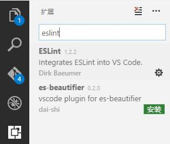

# 环境安装文档(for Ubuntu)

这个文档的目标是：各位小伙伴通过这个文档，可以在一台全新的 Ubuntu 电脑上搭建平常开发使用的环境，主要包含 Node.js, git 和 编辑器部分。

## [git](https://zh.wikipedia.org/wiki/Git) 和 git GUI

git 是一个版本控制工具，我们使用 [coding.net](https://coding.net) 存放 git 的远程仓库。

### git

1. 已有 git?

    在 bash 中查看 git 版本，建议使用 2.10 以后的 git (Windows)。

    ```bash
    $ git --version
    ```

1. 安装（[参考](http://stackoverflow.com/a/19109661)）

    ```bash
    $ sudo add-apt-repository ppa:git-core/ppa
    $ sudo apt-get update
    $ sudo apt-get install git
    ```

1. 完成

    在 bash 中查看 git 版本

    ```bash
    $ git --version
    ```

1. 设置信息

    可以设置提交所有仓库时使用的用户名和邮箱

    ```bash
    $ git config --global user.name "Your Name"
    $ git config --global user.email yourName@85ido.com
    ```

### git GUI

git 提供了命令行操作的方式，对于复杂的操作，还是有一个趁手的可视化工具为上。目前可用的 git GUI 工具有 [Git Extensions](https://gitextensions.github.io/)。本文主要介绍 Git Extensions 的安装和配置（[参考](https://github.com/gitextensions/gitextensions/wiki/Git-Extensions-on-Linux)）。

1. 安装 kdiff3

    ```bash
    $ sudo sudo apt install kdiff3
    $ kdiff3 --version
    ```

1. 安装 Mono 4.6+

    ```bash
    $ sudo apt-key adv --keyserver hkp://keyserver.ubuntu.com:80 --recv-keys 3FA7E0328081BFF6A14DA29AA6A19B38D3D831EF
    $ echo "deb http://download.mono-project.com/repo/debian wheezy main" | sudo tee /etc/apt/sources.list.d/mono-xamarin.list
    $ sudo apt update
    $ sudo apt install mono-complete
    $ mono --version
    ```

1. 下载

    [在这里下载](https://github.com/gitextensions/gitextensions/releases/latest)最新的 **Git Extensions Mono**。

1. 解压缩

    将下载好的 GitExtensions-*version*-Mono.zip 解压，双击 `GitExtensions.exe` 即可运行。

1. 设置

    完成安装后，还需要进行设置。

    尽量使用英文版的工具，因为不知道 **Rebase** 会被如何翻译。

    如果在安装 git 后不设置用户名和邮箱，第二行应该会呈现红色。

    

## [Node.js](https://zh.wikipedia.org/wiki/Node.js)

Node.js 的 release 规则是按月份 release，所以我们只需要用相对稳定且带有 LTS（长期维护）的版本即可，目前开发中使用到的是 Node.js 4.x

1. 已有 Node.js?

    查看 Node.js 版本，建议和团队使用一致的 Node.js。

    ```bash
    $ node -v
    ```

1. 安装

    ```bash
    $ curl -sL https://deb.nodesource.com/setup_4.x | sudo -E bash -
    $ sudo apt-get install nodejs
    ```

1. 结束

    在 bash 中查看 Node.js 版本
    ```shell
    $ node -v
    ```

## npm

npm 是 Node.js 的包管理工具，安装 Node.js 时会被一并安装。

### 升级 npm

但自带安装的 npm 版本过低(2.15)，需要进行升级。

```bash
$ npm install -g npm@latest
```

### 配置使用镜像

npm 默认使用的镜像在国内会受到速度影响，可以使用 cnpm 镜像替换默认的镜像。

1. 一次配置方案：只需要配置一次，配置完成后使用 `cnpm install` 代替 `npm install`。

    将如下内容拷贝到 ~/.bashrc 文件中

    ```
    #alias for cnpm
    alias cnpm="npm --registry=https://registry.npm.taobao.org --cache=$HOME/.npm/.cache/cnpm   --disturl=https://npm.taobao.org/dist --userconfig=$HOME/.cnpmrc"
    ```

    使用 `cnpm install` 替换 `npm install`

    ```bash
    $ cnpm install --save express
    ```

1. 一次性方案：在每次执行命令的最后添加使用的镜像，只生效一次。

    ```bash
    $ npm install --save express --registry=https://registry.npm.taobao.org
    ```

### 安装常用模块

有一部分模块是常用的，且需要进行全局安装，这些模块可以提前一次性安装。

```bash
$ npm install -g gulp babel-cli http-server
```

## 编辑器

在开发中有一个趁手的编辑器（No IDE）可以保证你不犯特别低级的错误，还可以使你的代码风格与团队保持一致。

推荐使用 [Visual Studio Code](https://code.visualstudio.com/) 写 Node.js 和前端代码。

### 安装

1. 下载

    [在这里下载](https://code.visualstudio.com/#alt-downloads) VSCode

    选择 .deb(Debian, Ubuntu) 版本

1. 安装

    ```bash
    $ cd /path/to/you/deb/file
    $ sudo apt-get install -f
    $ sudo dpkg -i deb-filename
    ```

1. 完成

    在搜索中输入 Code。

### 配置

1. 插件

    VSCode 可以安装一些插件，配合项目中的配置文件可以使文件属性与团队保持一致（如：文件末尾保持空行，使用哪个平台的行结束符等）。

    - 在左侧选择扩展，搜索 `editorconfig`，安装 `EditorConfig for VS Code`。

        
    
    - 搜索 `eslint`，安装 `ESLint`
    
        

1. 配色方案

    VS Code 自带集中配色方案，可以通过命令面板更换配色方案。

    按 `F1` 输入 `theme` 选择 “首选项：颜色主题”，使用方向键上下导航可以预览配色方案，回车确认。

## The End
