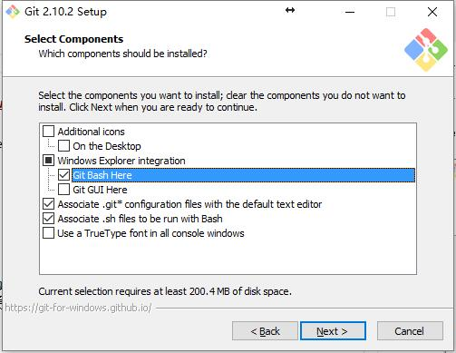
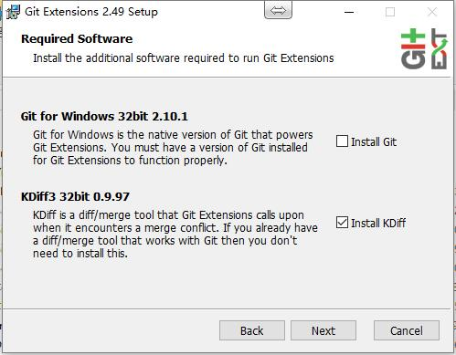
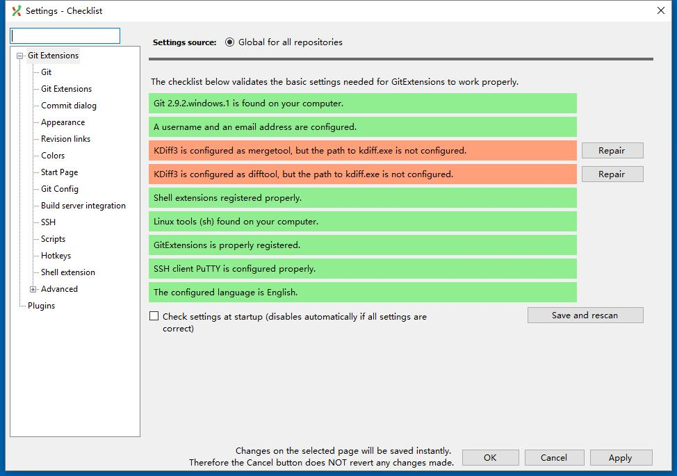
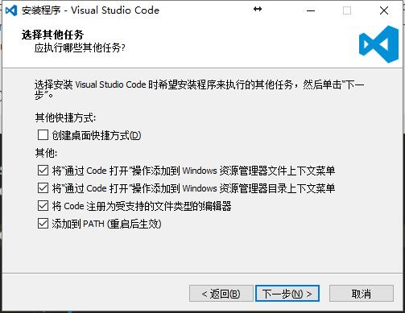
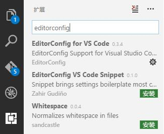
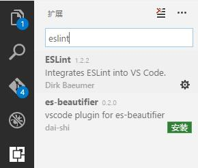

# 环境安装文档

这个文档的目标是：各位小伙伴通过这个文档，可以在一台全新的电脑上搭建平常开发使用的环境，主要包含 Node.js, git 和 编辑器部分。

**这是针对 Windows 系统的安装文档，Ubuntu 文档[点击这里](setup-ubuntu.md)。**

**下文提到的所有 bash，需要安装完 git 后，右键选择 Git Bash Here 调出。**

## [git](https://zh.wikipedia.org/wiki/Git) 和 git GUI

git 是一个版本控制工具，我们使用 [coding.net](https://coding.net) 存放 git 的远程仓库。

### git

1. 已有 git?

    在 bash 中查看 git 版本，建议使用 2.10 以后的 git (Windows)。

    ```bash
    $ git --version
    ```

1. 下载

    [下载 git](https://git-scm.com/download/win) 会自动检测你的操作系统和位数，提供下载的安装包。

1. 安装

    1. 重要：保持 **Git Bash Here** 选中。

        

    1. 其他步骤保持默认选项即可

1. 设置信息

    可以设置提交所有仓库时使用的用户名和邮箱

    ```bash
    $ git config --global user.name "Your Name"
    $ git config --global user.email yourName@85ido.com
    ```

1. 完成

    在 bash 中查看 git 版本

    ```bash
    $ git --version
    ```

### git GUI

git 提供了命令行操作的方式，对于复杂的操作，还是有一个趁手的可视化工具为上。目前可用的 git GUI 工具有 [Git Extensions](https://gitextensions.github.io/) 和 [SourceTree](https://www.sourcetreeapp.com/)。其中 SourceTree 免费试用 30 天，试用结束后可以通过注册账号继续使用，SourceTree 也提供了 Mac 客户端。本文主要介绍 Git Extensions 的安装和配置，SourceTree 同理。

1. 下载

    [在这里下载](https://github.com/gitextensions/gitextensions/releases/tag/v2.49)最新的 Git Extensions。

1. 安装

    在这一步时，可以一并安装 KDiff 3.

    

1. 设置

    完成安装后，还需要进行设置。

    尽量使用英文版的工具，因为不知道 **Rebase** 会被如何翻译。

    如果在安装 git 后不设置用户名和邮箱，第二行应该会呈现红色。

    

## [Node.js](https://zh.wikipedia.org/wiki/Node.js)

Node.js 的 release 规则是按月份 release，所以我们只需要用相对稳定且带有 LTS（长期维护）的版本即可，目前开发中使用到的是 Node.js 6.x

1. 已有 Node.js?

    查看 Node.js 版本，建议和团队使用一致的 Node.js。

    ```bash
    $ node -v
    ```

1. 下载

    可以在[这个地址](https://nodejs.org/dist/latest-v6.x/)下载 Node.js 6.x 版本，一般使用最后一个版本，写文档的时候最后的版本应该是 v6.10.3。对于 Windows 系统来说下载 .msi 文件安装即可。

1. 安装

    执行安装包安装即可，建议安装路径中不要包含中文，配置均可默认。

    *如果安装中报出 2502 或 2503 错误，需要将安装包移动到 `C:\Windows\Installer` 然后使用管理员模式的 powershell 或 cmd 执行文件。*

1. 结束

    在 bash 中查看 Node.js 版本
    ```shell
    $ node -v
    ```

## npm

npm 是 Node.js 的包管理工具，安装 Node.js 时会被一并安装（没关闭 npm package manager 的情况）。

### 升级 npm

但自带安装的 npm 版本过低，需要进行升级。

#### 在除 Windows 以外的系统上升级

[Moved to setup Ubuntu](setup-ubuntu.md)

#### 在 Windows 上升级

在 Windows 上升级需要借助一个模块：[npm-windows-upgrade](https://github.com/felixrieseberg/npm-windows-upgrade)，这部分只是把该模块的食用方法进行翻译。

注意：在 Windows 上升级 npm 需要使用 **管理员模式的 powershell** 执行以下的命令。

1. 设置

    ```
    Set-ExecutionPolicy Unrestricted -Scope CurrentUser -Force
    ```

1. 安装升级需要的模块

    ```
    npm install --global --production npm-windows-upgrade
    ```

1. 使用模块，将 npm 升级到 4.6.1

    ```
    npm-windows-upgrade --npm-version 4.6.1
    ```

1. 完成

    查看 npm 版本，与升级目标一致就成功啦。

    ```
    npm -v
    ```

### 配置使用镜像

npm 默认使用的源在国内会受到速度影响，可以使用 npm的淘宝镜像替换默认的镜像，或直接使用cnpm别名。

1. 修改npm镜像为淘宝镜像，只需要配置一次

    在命令行（cmd或bash）中执行如下命令：

    ```
    npm config set registry https://registry.npm.taobao.org
    ```

1. bash别名方案：只需要配置一次，配置完成后使用 `cnpm install` 代替 `npm install`（只能在git bash中使用）。

    将如下内容拷贝到 ~/.bashrc 文件中

    ```
    #alias for cnpm
    alias cnpm="npm --registry=https://registry.npm.taobao.org --cache=$HOME/.npm/.cache/cnpm   --disturl=https://npm.taobao.org/dist --userconfig=$HOME/.cnpmrc"
    ```

    使用 `cnpm install` 替换 `npm install`

    ```bash
    $ cnpm install --save express
    ```

1. 一次性方案：在每次执行命令的最后添加使用的镜像，只生效一次。

    ```bash
    $ npm install --save express --registry=https://registry.npm.taobao.org
    ```

### 安装常用模块

有一部分模块是常用的，且需要进行全局安装，这些模块可以提前一次性安装。

```bash
$ npm install -g gulp babel-cli http-server
```
## 编辑器

在开发中有一个趁手的编辑器（No IDE）可以保证你不犯特别低级的错误，还可以使你的代码风格与团队保持一致。

推荐使用 [Visual Studio Code](https://code.visualstudio.com/) 写 Node.js 和前端代码。

### 安装

1. 下载

    [在这里下载](https://code.visualstudio.com/#alt-downloads) VSCode

1. 安装

    保持“其他”中的选项选中。

    

1. 完成

    在 运行(Win+R) 中输入 Code 或点击桌面上的图标打开 VS Code。

### 配置

1. 插件

    VSCode 可以安装一些插件，配合项目中的配置文件可以使文件属性与团队保持一致（如：文件末尾保持空行，使用哪个平台的行结束符等）。

    - 在左侧选择扩展，搜索 `editorconfig`，安装 `EditorConfig for VS Code`。

        
    
    - 搜索 `eslint`，安装 `ESLint`
    
        

1. 配色方案

    VS Code 自带集中配色方案，可以通过命令面板更换配色方案。

    按 `F1` 输入 `theme` 选择 “首选项：颜色主题”，使用方向键上下导航可以预览配色方案，回车确认。

## The End
