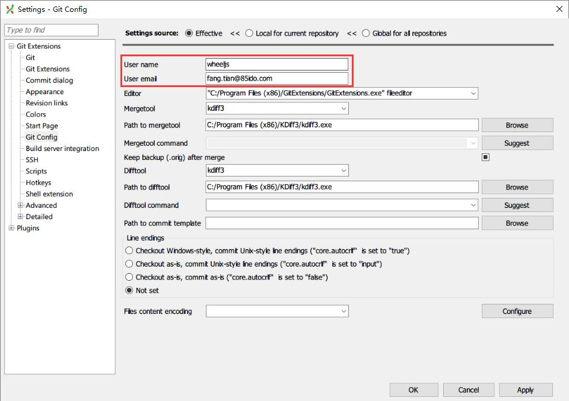
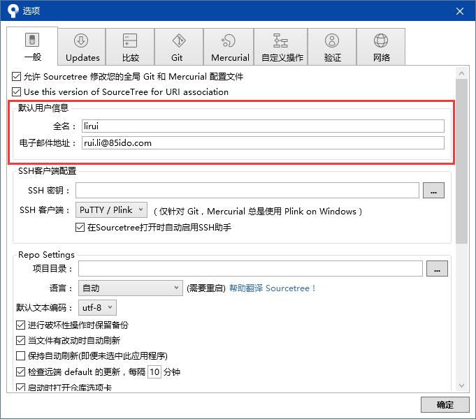

# Git Commit 说明

## 背景

目前我们大多数项目使用 Git 进行版本控制，对于 Git 用户名、邮箱的配置和 Commit Message 的写法一直没有一个约定，导致部分仓库的代码出现提交不好查找，每个提交包含的内容过多，甚至无法直观的了解该提交的作者是谁。这篇文章主要针对 Git 用户名、邮箱配置和 Commit Message 写法进行约定。以减少上述问题出现的可能性。

## 配置

在查看 Git 提交日志时，有两项重要的信息：作者和邮箱。**这两项信息的配置，在公司内部要保持可辨识性，能做到任何一个同事，进入一个项目后看到某个提交就知道该提交的作者，不要出现 QQ 邮箱。**

在安装 Git, GitExtensions, SourceTree 之后，需要验证自己的用户名、邮箱配置是否正确。用户名一般配置为姓名的英文，可以直接使用企业邮箱前半段，如：yumeng.ding, liangzheng.li 等，邮箱配置为自己的企业邮箱即可。

- 通过 Shell 配置用户名和邮箱

    ```shell
    $ git config --global user.name "Your Name"
    $ git config --global user.email yourName@85ido.com
    ```

    如果不添加 `--global` 参数，则默认对当前仓库进行配置。

- 在 GitExtensions 中配置用户名和邮箱

    **Tools > Settings > Git Extensions > Git Config**

    

    上方的 *Settings Source* 为当前配置生效的范围，建议直接选择 *Global for all repositories* 进行全局配置。

- 在 SourceTree 中配置用户名和邮箱

    **Tools > Settings > General**

    

## Commit Message

Commit Message 是用来描述本次提交的信息的，在介绍这一篇之前，首先有一个共识：

**“一个提交只做一件事，保持提交的单元性。”**

即每一个提交中包含的内容应该是一个逻辑单元（功能或者模块），而不是按照时间单元（如每天提交），不要怕提交的次数多，总比要 Revert 或 Cherry Pick 的时候发现拆不开强。后续 Git 培训时会具体展开说这一块。

这一点是非常重要的，下面的 Commit Message 写法都是以这个共识为基础的。

Commit Message 虽然不限制格式，但是业界已经有各种成熟的 Commit Message 格式规范，如：Angular 团队的规范、jQuery 团队的规范等。

格式化的 Commit Message 有以下几个好处：

1. 方便快速浏览和查找信息。

1. 可以根据 Commit Message 直接生成 Changelog，这部分按下不表。

我们的目标 Commit Message 模板如下（[继续阅读](http://www.ruanyifeng.com/blog/2016/01/commit_message_change_log.html)，下面的部分其实是根据成熟的规范精简得出的，如果能做到“继续阅读”中的那样，当然更好）：

    修改 MenuFilter

    修改进入获取菜单的逻辑判断，如果请求的是 /enter/，则放过让 Controller 处理。
    修改获取用户的方式，避免为空时报错。

    SMARTCONTE-274, SMARTCONTE-330

基于这个模板，我们可以整理出三部分：Header, Body 和 Footer，其中 Header 必须有，Body 和 Footer 可以省略。每个部分之间使用一个空行分隔。

- Header

Header 部分包含本次提交的概述，一般不超过 50 个字符。

- Body

这个提交的详细描述，可以分成多行，但是每行不要超过 72 个字符。可以尽可能详细的对变动的原因、思路、变动前后的使用方式进行说明。

- Footer

可以在这里通过引用 JIRA 任务编号的方式，与相应的 JIRA 任务产生关联；在 GitHub 中，可以通过 `Closes` 等关键词对 Issue 进行操作。

**不允许空 Commit Message，不允许使用 `+++++`, `--` 这类无法迅速查找和准确描述提交的 Commit Message。**
